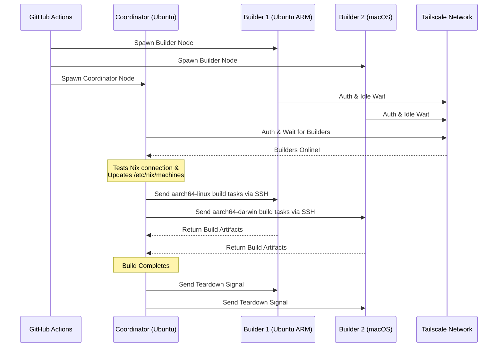

<div align="right">
  <details>
    <summary >🌐 Language</summary>
    <div>
      <div align="center">
        <a href="https://openaitx.github.io/view.html?user=Misaka13514&project=setup-distributed-nix-builds&lang=en">English</a>
        | <a href="https://openaitx.github.io/view.html?user=Misaka13514&project=setup-distributed-nix-builds&lang=zh-CN">简体中文</a>
        | <a href="https://openaitx.github.io/view.html?user=Misaka13514&project=setup-distributed-nix-builds&lang=zh-TW">繁體中文</a>
        | <a href="https://openaitx.github.io/view.html?user=Misaka13514&project=setup-distributed-nix-builds&lang=ja">日本語</a>
        | <a href="https://openaitx.github.io/view.html?user=Misaka13514&project=setup-distributed-nix-builds&lang=ko">한국어</a>
        | <a href="https://openaitx.github.io/view.html?user=Misaka13514&project=setup-distributed-nix-builds&lang=hi">हिन्दी</a>
        | <a href="https://openaitx.github.io/view.html?user=Misaka13514&project=setup-distributed-nix-builds&lang=th">ไทย</a>
        | <a href="https://openaitx.github.io/view.html?user=Misaka13514&project=setup-distributed-nix-builds&lang=fr">Français</a>
        | <a href="https://openaitx.github.io/view.html?user=Misaka13514&project=setup-distributed-nix-builds&lang=de">Deutsch</a>
        | <a href="https://openaitx.github.io/view.html?user=Misaka13514&project=setup-distributed-nix-builds&lang=es">Español</a>
        | <a href="https://openaitx.github.io/view.html?user=Misaka13514&project=setup-distributed-nix-builds&lang=it">Italiano</a>
        | <a href="https://openaitx.github.io/view.html?user=Misaka13514&project=setup-distributed-nix-builds&lang=ru">Русский</a>
        | <a href="https://openaitx.github.io/view.html?user=Misaka13514&project=setup-distributed-nix-builds&lang=pt">Português</a>
        | <a href="https://openaitx.github.io/view.html?user=Misaka13514&project=setup-distributed-nix-builds&lang=nl">Nederlands</a>
        | <a href="https://openaitx.github.io/view.html?user=Misaka13514&project=setup-distributed-nix-builds&lang=pl">Polski</a>
        | <a href="https://openaitx.github.io/view.html?user=Misaka13514&project=setup-distributed-nix-builds&lang=ar">العربية</a>
        | <a href="https://openaitx.github.io/view.html?user=Misaka13514&project=setup-distributed-nix-builds&lang=fa">فارسی</a>
        | <a href="https://openaitx.github.io/view.html?user=Misaka13514&project=setup-distributed-nix-builds&lang=tr">Türkçe</a>
        | <a href="https://openaitx.github.io/view.html?user=Misaka13514&project=setup-distributed-nix-builds&lang=vi">Tiếng Việt</a>
        | <a href="https://openaitx.github.io/view.html?user=Misaka13514&project=setup-distributed-nix-builds&lang=id">Bahasa Indonesia</a>
        | <a href="https://openaitx.github.io/view.html?user=Misaka13514&project=setup-distributed-nix-builds&lang=as">অসমীয়া</
      </div>
    </div>
  </details>
</div>

# ❄️ Setup Distributed Nix Builds

A GitHub Action to instantly provision an ephemeral, cross-platform [Distributed Nix Build](https://wiki.nixos.org/wiki/Distributed_build) cluster using standard [GitHub Hosted Runners](https://docs.github.com/en/actions/reference/runners/github-hosted-runners) securely connected via Tailscale.

This action allows you to spin up a matrix of secondary GitHub runners (the **Builders**) and connect them to a primary runner (the **Coordinator**) seamlessly over Tailscale SSH. The Coordinator automatically configures Nix to use these nodes as remote builders, maximizing concurrent build performance without managing external infrastructure! It is perfect for building multi-architecture packages or horizontally scaling heavy NixOS system closures across a fleet of x86 runners.

## Features

- 🚀 **Zero-Config Remote Builders:** Automatically configures `/etc/nix/machines` and connects nodes via Tailscale SSH (no manual SSH keys required!).
- 🌍 **Cross-Platform & Multi-Arch:** Mix and match Ubuntu (x86, ARM) and macOS (Intel, Apple Silicon) runners in the same build.
- ⚖️ **Horizontal Scaling for NixOS:** Need to evaluate and build a massive NixOS configuration? Spin up an entire farm of identical nodes (e.g., five `ubuntu-24.04` runners) and let Nix automatically distribute parallel derivation builds across all available CPU cores in the cluster.
- 🧹 **Maximum Disk Space:** Automatically cleans up pre-installed software on Linux runners (via [nothing-but-nix](https://github.com/wimpysworld/nothing-but-nix)) to give your Nix store maximum breathing room.
- ⚡ **Built-in Caching:** Integrates [magic-nix-cache](https://github.com/DeterminateSystems/magic-nix-cache-action) to speed up flake evaluations and local builds.
- 🛑 **Graceful Teardown:** Builders wait idly for tasks and self-terminate gracefully when the Coordinator finishes.

## How It Works

The workflow separates runners into two roles: `builder` and `coordinator`.



## Prerequisites

Before using this action, you need to configure a Tailscale network for the runners to communicate securely.

1. **Configure Tailscale ACLs:**
   Ensure your Tailscale has tag groups created and ACLs allow the coordinator to SSH into the builders seamlessly using Tailscale SSH.
   Add the following to your [Tailscale Access Controls](https://login.tailscale.com/admin/acls/file):

<details>
<summary>Click to view required Tailscale ACL configuration</summary>

```json
{
  "grants": [
    {
      "src": ["tag:nix-ci-builder", "tag:nix-ci-coordinator"],
      "dst": ["tag:nix-ci-builder", "tag:nix-ci-coordinator"],
      "ip": ["*"]
    }
  ],
  "ssh": [
    {
      "src": ["tag:nix-ci-coordinator"],
      "dst": ["tag:nix-ci-builder"],
      "users": ["autogroup:nonroot", "root"],
      "action": "accept"
    }
  ],
  "tagOwners": {
    "tag:nix-ci-coordinator": ["autogroup:admin", "tag:nix-ci-coordinator"],
    "tag:nix-ci-builder": ["autogroup:admin", "tag:nix-ci-builder"]
  }
}
```
</details>

2. **Create a Tailscale OAuth Client:**
   Generate an OAuth Client Secret in your [Tailscale Admin panel](https://login.tailscale.com/admin/settings/trust-credentials), with `auth_keys` write scope and `nix-ci-builder` `nix-ci-coordinator` tags.
   Add this secret to your GitHub Repository Secrets as `TS_OAUTH_SECRET`.

## Inputs

| Input                | Description                                                                                     | Required | Default     |
| -------------------- | ----------------------------------------------------------------------------------------------- | -------- | ----------- |
| `tailscale_authkey`  | Tailscale OAuth client secret or Auth Key.                                                      | **Yes**  | N/A         |
| `tailscale_hostname` | Hostname to register with Tailscale.                                                            | **Yes**  | N/A         |
| `tailscale_tags`     | Tags to advertise to Tailscale (e.g. `tag:nix-ci-builder`).                                     | **Yes**  | N/A         |
| `role`               | Role of the current job: `"builder"` or `"coordinator"`.                                        | Yes      | `"builder"` |
| `builders`           | Space separated list of full builder hostnames to wait for. (_Required if role is coordinator_) | No       | `""`        |
| `builder_timeout`    | Maximum time (in seconds) the builder should wait before self-terminating.                      | No       | `"300"`     |
| `extra_nix_config`   | Extra Nix configuration to append to `/etc/nix/nix.conf`.                                       | No       | `""`        |

## Usage

### Full Distributed Build Example

Below is a complete workflow (`nix-build.yml`) that dynamically spins up multiple runner architectures (Ubuntu x86, Ubuntu ARM, macOS x86, macOS Apple Silicon), connects them together, and runs a distributed Nix build.

If you are building a heavy NixOS configuration and simply want to speed it up using horizontal scaling, you can change the `BUILDER_COUNTS` to spawn multiple identical x86 runners. For example:
`BUILDER_COUNTS: '{"ubuntu-24.04": 4}'` 
This will instantly give you a build farm with 16 CPU cores (4 runners × 4 cores) to process derivations in parallel.

Since GitHub Hosted Runners are ephemeral, all build artifacts in the Nix store will be lost when the workflow finishes. To reap the benefits of your distributed builds in future CI runs or on your local machines, it is highly recommended to push the results to a binary cache like [Cachix](https://www.cachix.org) or [Attic](https://github.com/zhaofengli/attic).

```yaml
name: Distributed Nix Build

on:
  workflow_dispatch:

env:
  # Define exactly how many runners of each OS type you want
  BUILDER_COUNTS: '{"ubuntu-24.04": 1, "ubuntu-24.04-arm": 1, "macos-26-intel": 1, "macos-26": 1}'

jobs:
  config:
    runs-on: ubuntu-slim
    outputs:
      builder_matrix: ${{ steps.set.outputs.builder_matrix }}
      builders_list: ${{ steps.set.outputs.builders_list }}
      run_suffix: ${{ steps.set.outputs.run_suffix }}
    steps:
      - id: set
        run: |
          SUFFIX=$(openssl rand -hex 3)
          echo "run_suffix=$SUFFIX" >> "$GITHUB_OUTPUT"

          # Dynamically generate the Matrix JSON based on BUILDER_COUNTS
          MATRIX_JSON=$(echo '${{ env.BUILDER_COUNTS }}' | jq -c '[
              to_entries[] | .key as $os | .value as $count |
              range(1; $count + 1) | { os: $os, id: "\($os)-\(.)" }
            ]
          ')
          echo "builder_matrix=$MATRIX_JSON" >> "$GITHUB_OUTPUT"

          # Create a space-separated list of hostnames for the coordinator
          BUILDERS_LIST=$(echo "$MATRIX_JSON" | jq -r --arg suffix "$SUFFIX" 'map("nix-builder-\($suffix)-\(.id)") | join(" ")')
          echo "builders_list=$BUILDERS_LIST" >> "$GITHUB_OUTPUT"

  builder:
    needs: config
    name: Builder ${{ matrix.builder.id }} (${{ needs.config.outputs.run_suffix }})
    runs-on: ${{ matrix.builder.os }}
    strategy:
      fail-fast: false
      matrix:
        builder: ${{ fromJSON(needs.config.outputs.builder_matrix) }}
    steps:
      - name: Setup Distributed Nix Builder
        uses: Misaka13514/setup-distributed-nix-builds@main
        with:
          tailscale_authkey: ${{ secrets.TS_OAUTH_SECRET }}
          tailscale_hostname: nix-builder-${{ needs.config.outputs.run_suffix }}-${{ matrix.builder.id }}
          tailscale_tags: tag:nix-ci-builder
          role: builder

      # Optionally configure your Cachix/Attic or other caching here
      # - uses: cachix/cachix-action@v17

  coordinator:
    needs: config
    name: Coordinator (${{ needs.config.outputs.run_suffix }})
    runs-on: ubuntu-24.04
    steps:
      - name: Setup Coordinator & Connect Builders
        uses: Misaka13514/setup-distributed-nix-builds@main
        with:
          tailscale_authkey: ${{ secrets.TS_OAUTH_SECRET }}
          tailscale_hostname: nix-coordinator-${{ needs.config.outputs.run_suffix }}
          tailscale_tags: tag:nix-ci-coordinator
          role: coordinator
          builders: ${{ needs.config.outputs.builders_list }}

      # Optionally configure your Cachix/Attic or other caching here
      # - uses: cachix/cachix-action@v17

      - name: Execute Distributed Build
        run: |
          # Your build command here. Because builders are registered in /etc/nix/machines,
          # Nix will automatically offload tasks to the correct architecture node.
          nix build -L --max-jobs 0 .#my-package

      # Signal builders to terminate if they are not needed anymore
      - name: Teardown Builders
        run: stop-nix-builders

      # Push build results to Cachix/Attic or other cache here if desired
      # - name: Push to Cachix
      #   run: cachix push mycache --all
```

## License

This project is licensed under the [MIT License](LICENSE).
